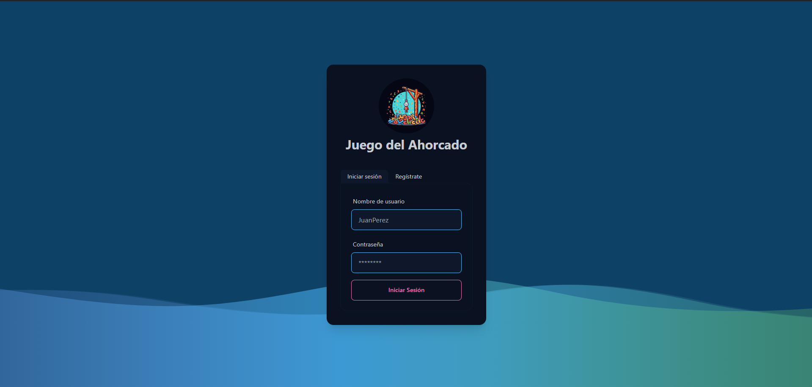

# Juego del Ahorcado

Este proyecto es un juego de ahorcado desarrollado con Node.js, Express, React, Vite, TailwindCSS, DaisyUI, MySQL y Json Web Token.

## Características

- **Login y Registro:** Los usuarios pueden registrarse e iniciar sesión para acceder al juego.
- **Dashboard:** Presenta una tabla de puntuaciones que muestra las mejores puntuaciones de los jugadores, tambien los usuarios pueden agregar nuevas palabras al juego para aumentar la diversidad.
- **Pantalla de Juego:**
  - **Imágenes de Ahorcado:** Muestra imágenes que representan el progreso del juego.
  - **Vidas:** Las vidas del jugador dependen de la dificultad seleccionada: fácil (6 vidas), medio (4 vidas), difícil (2 vidas).
  - **Tiempo:** Cada pregunta tiene un tiempo determinado para responder.
  - **Pistas:** Dependiendo de la dificultad, se proporcionan pistas cuando se pierden ciertas vidas: fácil (3 vidas), medio (2 vidas), difícil (1 vida).
  - **Teclado:** Los jugadores pueden agregar letras para adivinar la palabra oculta.

## Reglas del Juego

### Vidas:

| Facil   | Medio   | Dificil |
| ------- | ------- | ------- |
| 6 Vidas | 4 Vidas | 2 Vidas |

### Puntos:

| Facil               | Medio               | Dificil             |
| ------------------- | ------------------- | ------------------- |
| 1 Punto por acierto | 2 Punto por acierto | 3 Punto por acierto |

### Pistas:

| Facil             | Medio             | Dificil           |
| ----------------- | ----------------- | ----------------- |
| al perder 3 vidas | al perder 2 vidas | al perder 1 vidas |

## Tecnologías Utilizadas

- **Node.js y Express:** Para el backend del juego.
- **React y Vite:** Para la interfaz de usuario.
- **TailwindCSS y DaisyUI:** Para el diseño y estilizado.
- **MySQL:** Para almacenar datos relacionados con usuarios, palabras y puntuaciones.
- **Json Web Token:** Para autenticación y autorización de usuarios.

## Instalación

1. Clona este repositorio: `git clone https://github.com/JoshuaMc1/Hangman-Game-React.git`
2. Instala las dependencias del backend: `cd server && npm install`
3. Instala las dependencias del frontend: `npm install`
4. Configura tu base de datos MySQL y establece las credenciales en el archivo de configuración `.env` dentro del directorio `server`.
5. Ejecuta el servidor: `npm run dev` dentro del directorio `server`.
6. Ejecuta el frontend: `npm run dev` dentro del directorio `/`.

## Contribución

¡Siéntete libre de contribuir al proyecto! Puedes abrir problemas para reportar errores o sugerir nuevas características, o enviar solicitudes de extracción con tus propias contribuciones.

## Licencia

Este proyecto está licenciado bajo la Licencia MIT - ver el archivo [LICENSE](LICENSE) para más detalles.

---

¡Esperamos que disfrutes jugando este juego del ahorcado tanto como nosotros disfrutamos creándolo! Si tienes alguna pregunta o comentario, no dudes en comunicarte con nosotros. ¡Diviértete!
